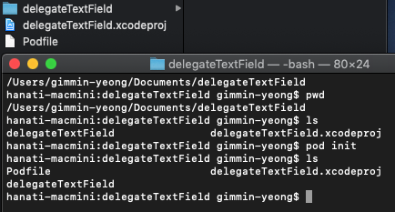
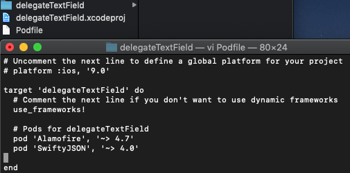
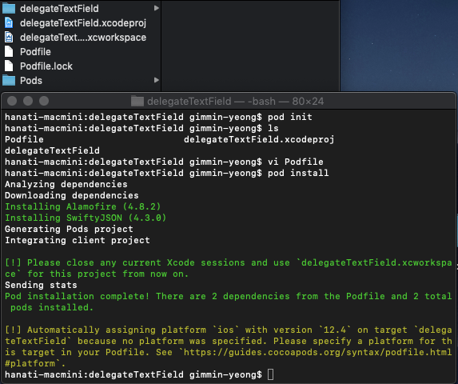
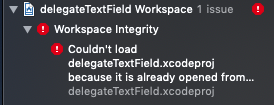
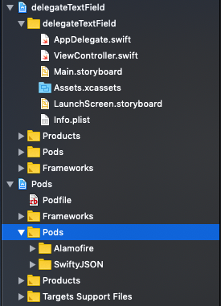

## cocoapods Install
```
sudo gem install cocoapods
```
<br>
## Usage

* 해당 dir로 이동 후 

```
pod init
````



<br>

```
vi Podfile
```




ex) alamofire, SwiftyJson

* pod install



설치 후 ~workspace를 열어서 개발 진행 ( 기존 열었던 ~/.xcodeproj을 닫고 난 후)




안하면 이런 에러가 나옴

설치 후 프로젝트 구조는 이렇게 생성됨.


