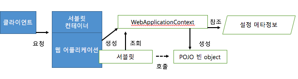
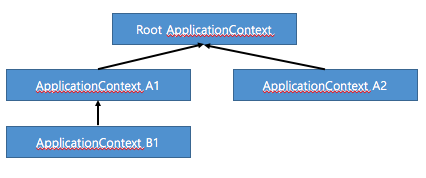
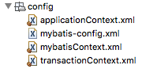
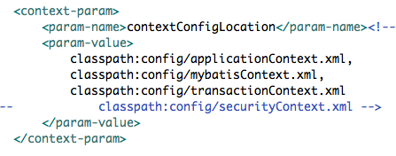

## IoC 컨테이너와 DI

**IoC(Inversion of Control) 
컨테이너가 코드 대신 오프젝트에 대한 제어권을 갖고 있다. 
IoC 담당하는 컨테이너를 Bean Factory 또는 Application Context. 
오프젝트 생성과 런타임 관계를 설정하는 D.I (Dependency Injection)관점으로 볼 땐 컨테이너는 Bean Factory. 
스프링은 특정 포맷의 설정에 종속, 제한된적이 없고 어떤 형태로도 빈 설정 메타정보를 작성 가능함. 
 

## StaticApplicationContext

학습 테스트용

## GenericApplicationContext

ex) junit test . .@contextConfiguration

xml파일 같은 외부 리소스에 있는 빈 설정 메타정보를 BeanDefinitionReader 로 변환하여 읽는다.(구현체로)

ex) XmlBeanDefinitionReader : classpaht: , file: , http: 접두어를 통해 구체적인 리소스 타입 지정가능

일반적인 애플리케이션 구현 클래스

DI를 통해 확장할 수 있게 설계되어 있다 

## GenericXmlApplicationContext

XmlBeanDefinitionReader 내장

## WebApplicationContext

가장 많이 사용되는 Application Context

웹환경에서 사용할 때 필요한 기능이 추가된 ApplicationContext

서블릿 커네이너가 브라우저로부터 오는 HTTP 요청을 받아서 해당 요청에 매핑되어 있는 서블릿을 실행해주는 방식

서블릿이 일종의 main() 메소드 역할을 하는 셈

서블릿 컨테이너는 브라우저와 같은 클라이언트로 들어오는 요청을 받아서 서블릿을 작동시켜준다.

서블릿은 웹 어플리케이션이 시작될 때 미리 만들어둔 WebApplicationContext에서 빈 오프젝트에 구성된 어플리케이션의 기동 역할을 해줄 빈을 요청해서 받는다. 

## DispatcherServlet

 이름의 서블릿을 스프링에서 제공

스프링 IoC 컨테이너는 WebApplicationContext 인터페이스를 구현한 것

각자 독립적인 설정정보를 이용해  빈 오브젝트를 만들고 관리함

자신의 부모 컨텍스트에게만 빈 검색 요청 자식 컨텍스트에게는 오청 X

검색 순서는 항상 자신이 먼저, 다음 직계 부모의 순서

자식 컨텍스트의 빈이 부모 컨텍스트 빈과 중복될 때 자식 컨텍스트가 우선한다.

 
**프론트 컨트롤러 패턴

많은 웹 요청을 한번에 받을 수 있는 대표 서블릿을 등록해 공통 선행 작업을 수행 후
각 요청의 기능을 담당하는 핸들러라 불리는 클래스를 호출하는 방식

중앙집중식으로 모든 요청을 다 받아서 처리 

일반적으로는

스프링 어플리케이션 컨텍스트를 가지면서 프론트 컨트롤러 역할을 하는 서블릿은 하나만 만들어 사용

Why? 

웹 기술에 의존적인 부분과 그렇지 않은 부분(Bussiness Logic)을 구분하기 위해서이다.

스프링 서블릿을 사용하는 스프링의 웹 기술외의 웹 기술을 고려중일 경우 계층 형태로 구분하는 것이 바람직

—> 언제든지 확장, 변경, 조합을 사용할 수 있다.

## RootApplicationContext

서블릿 이벤트 리스너를 이용하여 웹 어플리케션이 시작 될 대 Root ApplicationContext을 만들어 초기화한다.

Spring은 ContextLoaderListener를 제공

default 경로 : /WEB-INF/applicationContext.xml

* contextConfigLocation을 이용하여 설정 위치를 정할 수 있음.

웹 계층 외의 빈을 정의

서비스 계층과 데이터 엑세스 계층의 빈을 모두 포함하며 각종 기반 서비스 및 기술 설정을 갖는다.

