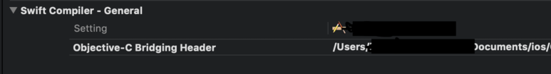

>
Objective-C로 Build한 static Library를 Swift에서 사용할 때 Bridge Header를 사용한다. Birdge Header를 명시적으로 Project config( Build Settings)에 지정해줘야 필요한 Header를 import할 수 있다. 

```
unknown>:0: error: error opening input file '~/***.h' (No such file or directory)
Showing All Messages
Error opening input file '~/***.h' (No such file or directory)
```

 <br>

>
objective-c를 이용하기 위한 Bridge Header 생성시 환경변수를 사용하여 프로젝트의 디렉토리가 변경되더라도 변경없이 사용 가능.

ex) 

```
$(PROJECT_DIR)/$(PROJECT_NAME)/$(PROJECT_NAME)-Bridging-Header.h
```

$(PROJECT_DIR):프로젝트 경로

$(PROJECT_NAME):프로젝트명
