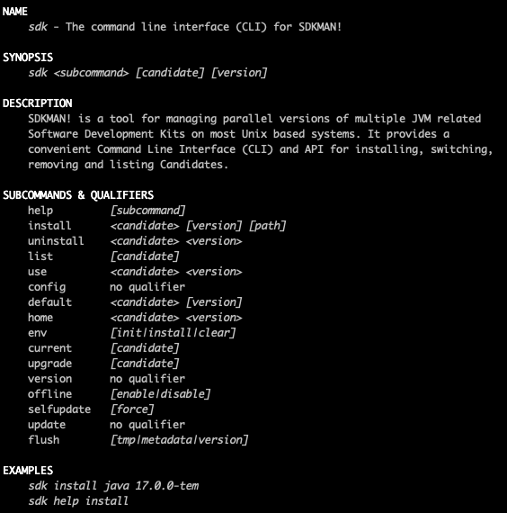
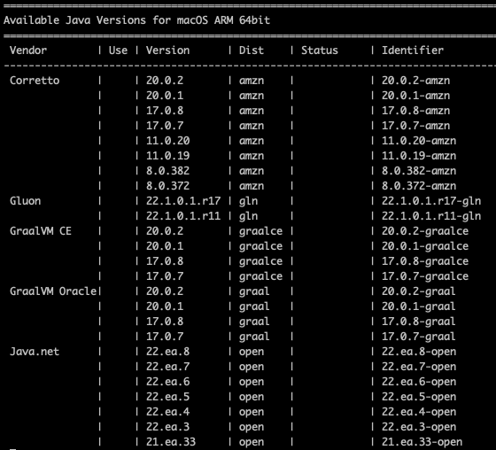
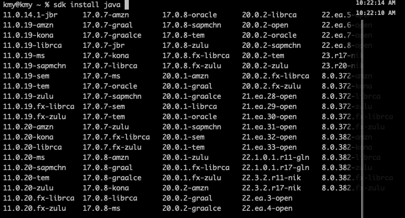
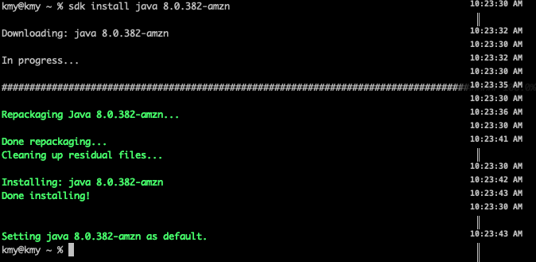
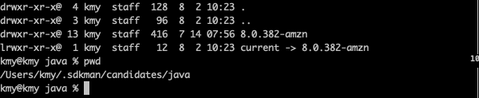

# SDKMAN 설치 방법, 사용법 ex JAVA_HOME
>
[SDK(Software Development Kit) Manager CLI](https://sdkman.io/) 는 커맨드 라인에서 다양한 종류의 Open JDK 와 ant, gradle, maven **등 Java 기반 개발 도구를 설치하고 관리할 수 있게 해주는 command line 유틸리티입니다.

yum 이나 apt, brew 같은 패키지 매니저에 등록된 Open JDK 는 벤더가 다양하지 않고 업데이트가 자주 되지 않으며 하나의 버전밖에 사용하지 못하는 단점이 있습니다.

SDKMan 은 [RVM(Ruby Version Manager)](https://lesstif.atlassian.net/wiki/spaces/SADM/pages/889266509) 처럼 다양한 벤더와 버전의 Open JDK 를 사용할 수 있게 해주며 Linux와 OSX, Solaris 등 여러 Unix 계열 운영체제를 지원합니다.

<br>
## Installation

공홈 >> [Installation - SDKMAN! the Software Development Kit Manager](https://sdkman.io/install)

```bash
%curl -s "https://get.sdkman.io" | bash

%source "$HOME/.sdkman/bin/sdkman-init.sh"

%sdk version
```

<br>
## Usage



```bash

$sdk list java

```


>>> Identifier로 선택하여 설치 가능


>>> sdk install java [TAB] 할 경우 Identifier가 출력된다.


>>> 설치후 default로 설정된다.

<br>
## JAVA_HOME
>>> SDKMAN으로 설치된 JAVA_HOME 경로는 “/Users/kmy/.sdkman/candidates/java”



```bash
$sdk home java 17.0.7-amzn
```

<br>
