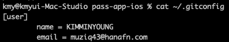
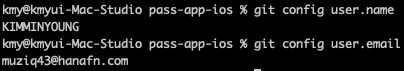

git의 개인정보(UserName, Email) 설정을 할 수 있다.

# 1. git Global 설정
<br>


> 설정
```bash
git config --global user.name "name"
git config --global user.email "email"
```
<br>
> 확인

```bash
cat ~/.gitconfig
```



or

```bash
git config user.name
git config user.email
```


<br>

# 2. Repository 별 사용자, 이메일 설정

> 설정
```bash
git config user.name "name"
git config user.email "email"
```

>>> Global 설정보다 우선되어 적용됨.

<br>


# 3. 삭제
> 설정
```bash
$ git config --global --unset user.name 
$ git config --glabal --unset user.email 
## or
$ git config  --unset user.name 
$ git config  --unset user.email 
```
<br>


# 4. git commit과 Github 사용자는 등록된 메일로 Mapping
>> [심화 GPG서명 등록](https://www.44bits.io/ko/post/add-signing-key-to-git-commit-by-gpg)