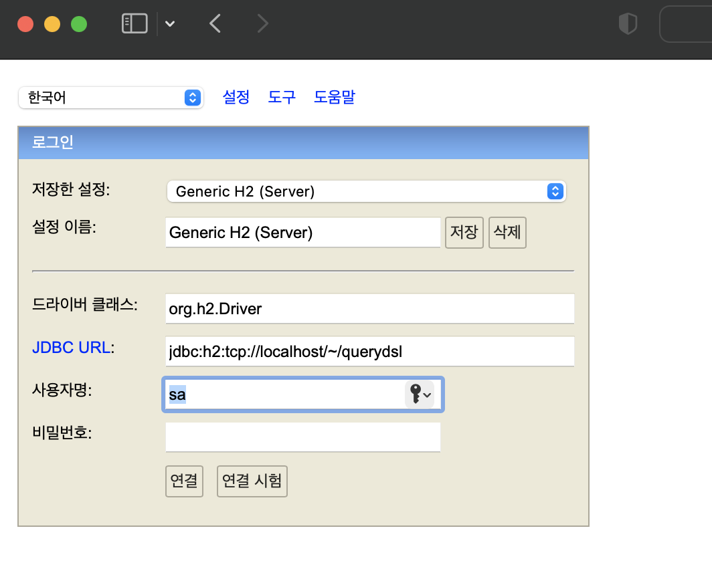

### Overview
JAVA SQL Database로 in-memory DB이다. 경량 DB로 Local 환경에서 테스트에 용의하게 사용되곤 한다.
아래와 같은 특징을 가진다.
#### Features

- Very fast, open source, JDBC API
- Embedded and server modes; disk-based or in-memory databases
- Transaction support, multi-version concurrency
- Browser based Console application
- Encrypted databases
- Fulltext search
- Pure Java with small footprint: around 2.5 MB jar file size
- ODBC driver


### Installation

- 설치 : [url](https://www.h2database.com/html/main.html)

- unzip
```bash
gzip -d ~~~.tar.gz
tar -xvf ~~~.tar
```
<br>
- 권한 변경 및 실행
```bash
## zip을 풀어준 경로 이동(./h2/bin)
cd ./h2/bin
#권한 변경
chmod 755 h2.sh
#실행
./h2.sh
```
<br>


- 접속을 위한 정보

```bash
## 로컬에 DB생성
jdbc:h2:~/querydsl

## TCP로 접속
jdbc:h2:tcp://localhost/~/querydsl
```
<br>

### 프로젝트 DB설정
application.yml에서 Database설정은 아래와 같다.

```yaml
spring:
  datasource:
    driver-class-name: org.h2.Driver
    url: jdbc:h2:tcp://localhost/~/querydsl
    username: sa
    password:
```
<br>