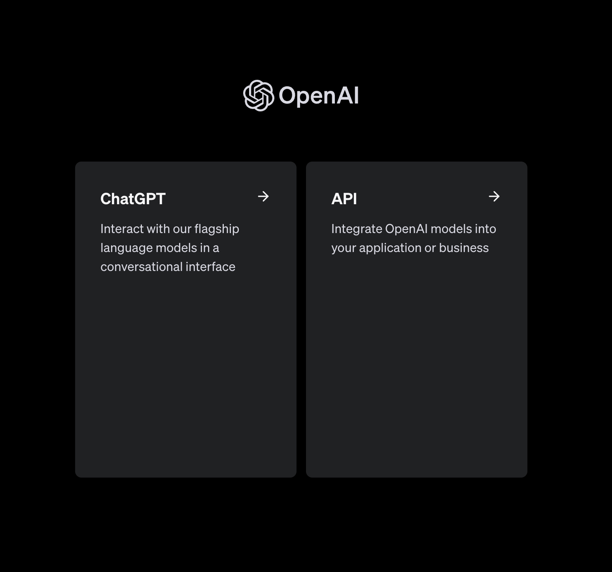
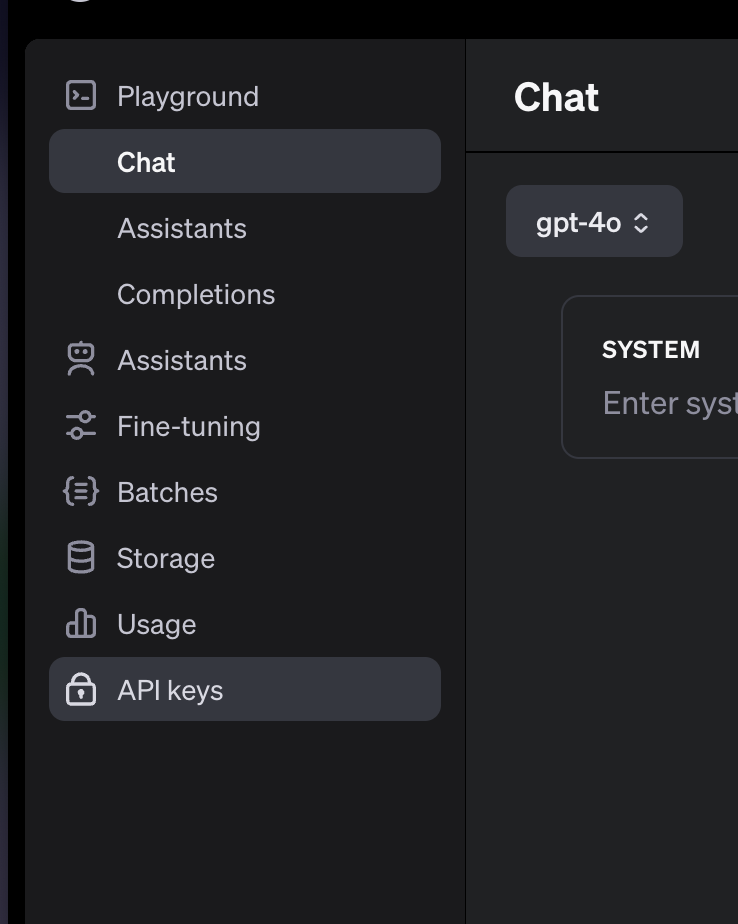
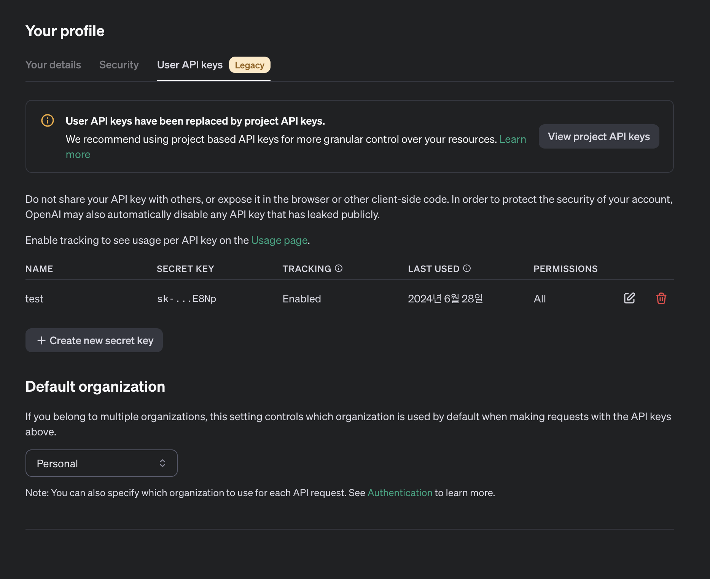

### Overview
화두되고 있는 OpenAI 사의 생성형AI ChatGPT를 API를 활용하여 간단한 프롬프트를 보내고 응답받는 예시를 진행해본다.
RAG나 파인튜닝 같은 개념보단, 단순 OpenAI에서 제공하는 API를 활용하는 방식이다.


## 1
[OpenAI 회원가입 후 API Key를 발급한다.](https://platform.openai.com/apps)


> API 클릭





> Create new Secret Key

<br/>

## 2-1 

```java
//Service Layer
        WebClient webClient = WebClient.builder()
                .baseUrl(url)
                .defaultHeader("Authorization", "Bearer "+secret)
                .build();

        String bodyVal = String.format("{"
                + "\"model\": \"%s\","
                + "\"messages\": [{\"role\": \"%s\", \"content\": \"%s\"}],"
                + "\"temperature\": 0.7,"
                + "\"max_tokens\": 256,"
                + "\"top_p\": 1,"
                + "\"frequency_penalty\": 0,"
                + "\"presence_penalty\": 0,"
                + "\"stream\": true"
                + "}", GPT_MODEL, roleUser, prompt);
```
> 발급한 SecretKey, Controller단에서 넘겨주는 prompt를 Binding한다.

### 2-2

* **필수 항목**
  - **messages**: 대화 내용을 포함하는 메시지 목록 (배열)
  - **model**: 사용할 모델의 ID (문자열)
* 선택적 항목
  * frequency_penalty: 텍스트 반복을 줄이는 패널티 (-2.0 ~ 2.0)
  * logit_bias: 특정 토큰의 출현 가능성 수정 (맵)
  * logprobs: 출력 토큰의 로그 확률 반환 여부 (불리언)
  * top_logprobs: 각 토큰 위치에서 가장 가능성 높은 토큰 수 (0-20 정수)
  * max_tokens: 생성 가능한 최대 토큰 수 (정수)
  * n: 각 입력 메시지에 대해 생성할 선택지 수 (정수)
  * presence_penalty: 새로운 주제 언급 가능성 증가 패널티 (-2.0 ~ 2.0)
  * response_format: 모델 출력 형식 지정 (객체)
  * seed: 결정론적 샘플링을 위한 시드 값 (정수)
  * service_tier: 요청 처리를 위한 지연 시간 티어 (문자열)
  * stop: 토큰 생성을 중지할 시퀀스 (문자열/배열)
  * **stream**: 부분 메시지 델타 전송 여부 (불리언)
  * stream_options: 스트리밍 응답 옵션 (객체)
  * **temperature**: 샘플링 온도 (0-2 사이 숫자)
  * top_p: 핵 샘플링에 사용되는 확률 질량 (0-1 사이 숫자)
  * tools: 모델이 호출할 수 있는 도구 목록 (배열)
  * tool_choice: 모델이 사용할 도구 제어 (문자열/객체)
  * parallel_tool_calls: 병렬 함수 호출 활성화 여부 (불리언)
  * **user**: 최종 사용자를 나타내는 고유 식별자 (문자열)
* 더 이상 사용되지 않는 항목
  * function_call: 함수 호출 제어 (문자열/객체) - tool_choice로 대체됨
  * functions: 모델이 JSON 입력을 생성할 수 있는 함수 목록 (배열) - tools로 대체됨

> [공식문서](https://platform.openai.com/docs/api-reference/chat/create)

## 2-3
```java
//Service Layer
        return webClient.post()
                .uri("/chat/completions")
                .contentType(MediaType.APPLICATION_JSON)
                .bodyValue(bodyVal)
                .retrieve()
                .bodyToFlux(String.class)
                .map(chunk -> chunk.replace("data: ", "").trim())
                .filter(chunk -> !chunk.equals("[DONE]"))
                .map(chunk -> {
                    try {
                        JsonNode jsonNode = new ObjectMapper().readTree(chunk);
                        return jsonNode.at("/choices/0/delta/content").asText();
                    } catch (JsonProcessingException e) {
                        return "";
                    }
                })
                .filter(content -> !content.isEmpty());
```

<br/>

```json
{
  "id": "chatcmpl-9exg9KPNME0pDdqReH6gYHNVfbLdA",
  "object": "chat.completion",
  "created": 1719549553,
  "model": "gpt-3.5-turbo-0125",
  "choices": [
    {
      "index": 0,
      "message": {
        "role": "assistant",
        "content": "2002년 월드컵에서 한국은 준결승까지 진출하여 4위를 차지했습니다. 이는 역사상 최고 성적이며 아시아 대륙에서는 최초로 준결승까지 진출한 팀이었습니다."
      },
      "logprobs": null,
      "finish_reason": "stop"
    }
  ],
  "usage": {
    "prompt_tokens": 26,
    "completion_tokens": 82,
    "total_tokens": 108
  },
  "system_fingerprint": null
}
```
> 해당 응답처럼 Json Format으로 온다. 여기서 필요한 내용은 content 내용이 결과이다. ObjectMapper를 통해 해당 내용을 파싱하여 필요한값을 추출한다.

<br/>

### 3

```java
// Controller 영역
    @GetMapping(value = "/chatFlux", produces = MediaType.TEXT_EVENT_STREAM_VALUE)
    public Flux<String> chatFlux(@RequestParam String prompt){
        return gptService.chatFlux(prompt);
    }
```
> **produces=MediaType.TEXT_EVENT_STREAM_VALUE** 설정으로 Spring은 해당 엔드포인트를 SSE 스트림으로 처리하고, 클라이언트와 서버 간의 효율적인 실시간 통신을 가능

### 4

```html
<!DOCTYPE html>
<html xmlns:th="http://www.thymeleaf.org">
<head>
~~~
</head>
<body>
<h1>ChatGPT Stream</h1>
<div id="chatbox"></div>
<input type="text" id="userInput" placeholder="메시지를 입력하세요...">
<button id="sendButton">전송</button>

<script th:inline="javascript">
    const chatbox = document.getElementById('chatbox');
    const userInput = document.getElementById('userInput');
    const sendButton = document.getElementById('sendButton');

    function appendMessage(sender, message) {
        const messageElement = document.createElement('p');
        messageElement.innerHTML = `<strong>${sender}:</strong> ${message}`;
        chatbox.appendChild(messageElement);
        chatbox.scrollTop = chatbox.scrollHeight;
    }

    function sendMessage() {
        const message = userInput.value.trim();
        if (message) {
            appendMessage('You', message);
            userInput.value = '';

            const eventSource = new EventSource(`/chatFlux?prompt=${encodeURIComponent(message)}`);
            let fullResponse = '';

            eventSource.onmessage = function(event) {
                const newContent = event.data;
                fullResponse += newContent;
                chatbox.lastChild.innerHTML = `<strong>ChatGPT:</strong> ${fullResponse}`;
                chatbox.scrollTop = chatbox.scrollHeight;
            };

            eventSource.onerror = function(error) {
                console.error('EventSource failed:', error);
                eventSource.close();
            };

            eventSource.onclose = function() {
                console.log('EventSource connection closed');
            };
        }
    }

    sendButton.addEventListener('click', sendMessage);
    userInput.addEventListener('keypress', function(e) {
        if (e.key === 'Enter') {
            sendMessage();
        }
    });
</script>
</body>
</html>
```
> EventSource이라는 웹 API를 사용하여 실시간 응답값을 처리한다.


