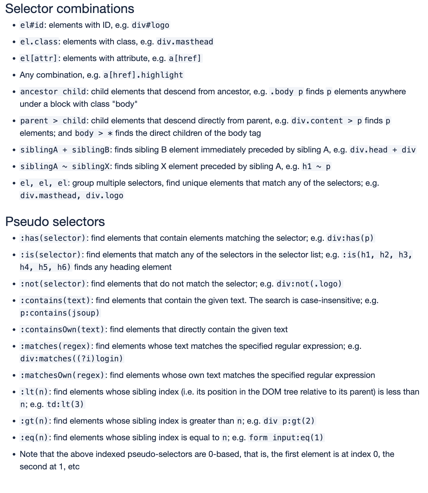

## Overview
Scrapping에 앞서 Web Crawling 또한 늘 연관 키워드로 함께 거론된다.<br>
Python에는 BeautifulSoup도 있고,, 다른건 잘모르겟다 ㅎ<br>
아래 표와 같이 Scrapping과 Crawling은 의미, 차이, 목적이 있다.<br>
상황, 목적에 맞게 사용해야 된다.


| :------ |:--- |
| Web Crawling | 모든 데이터를 수집 |
|  | A web crawler gathers URL(s). The crawler retrieves and analyzes the collected URLs. Crawler checks all the pages matching URLs, hyperlinks, all URLs, and meta tags. |
| Web Scrapping | 유효한 데이터를 정해 데이터를 취득한다. |
|  | The web scraping procedure must first determine the target website to scrape. |

<br>
## Java Scrapping Example 

#1 build.gradle
```groovy
implementation 'org.jsoup:jsoup:1.17.2'
```

<br>
#2 java
```java
Elements elements = Jsoup.connect(url) // #1
                    .get()
                    .select("#book_section-info span[class^=bookBasicInfo_spec]"); // #2

// output
// <span class="bookBasicInfo_spec__yzTpy">352<!-- -->쪽</span>
// <span class="bookBasicInfo_spec__yzTpy">700<!-- -->g</span>
// <span class="bookBasicInfo_spec__yzTpy">190*237*16<!-- -->mm</span>
```
1. Scrapping 하고자 하는 url
2. Select 할 Element의 ID, Class를 기입한다.

[** DOM Method를 사용](https://jsoup.org/cookbook/extracting-data/dom-navigation)<br>
[** Selector를 사용](https://jsoup.org/cookbook/extracting-data/selector-syntax)

<br>


## 참고
[https://www.baeldung.com/cs/web-crawling-vs-web-scraping](https://www.baeldung.com/cs/web-crawling-vs-web-scraping)<br>
[https://jsoup.org](https://jsoup.org)