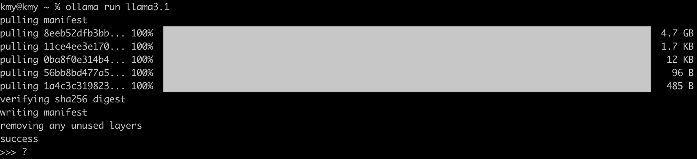

## Overview
생성형 AI이 화두되고 있는 시점에, Meta(구Facebook)에서 오픈소스로 생성형AI 모델을 공개하였다.(24.7.23)
llama3.1인데 8B, 70B, 405B 등 3가지 모델을 공개하였고, 405B 같은 모델은 상용 생성형 AI 모델과 성능을 견줄정도로 좋은 성능을 내고 있다.
각설하고, llama3.1 중 가장 작은 모델인 8B 설치방법과 간단한 사용방법을 기록한다.

## Installation

#1. [https://ollama.com/download](https://ollama.com/download)

해당 url에서 설치하고자 하는 OS에 맞게 Install한다.
(나는 MacOS M1 pro, 16G에서 설치)

#2. Ollama-darwin.zip
   위 파일이 다운로드되며, 압축을 풀고 Application 디렉토리로 옮긴다.

#3. ollama run llama3.1
   설치가 완료되면서 해당 Command가 나오며 터미널에 C&P한다.
- '8b' -> 'ollama run llama3.1'
- '70b' -> 'ollama run llama3.1:70b'
- '405b' -> 'ollama run llama3.1:405b'
  

> 해당 이미지처럼 약 5GB 가량 다운로드 받고 Success가 나오면 설치완료
바로 채팅을 이어 갈 수 있다.

## 마치면서,,,
앞으로 계획은 해당 LLM을 개인 리눅스, window PC 설치하여 상용 LLM 서비스처럼 api 통신으로 채팅을 할 수 있게 구축할 예정.