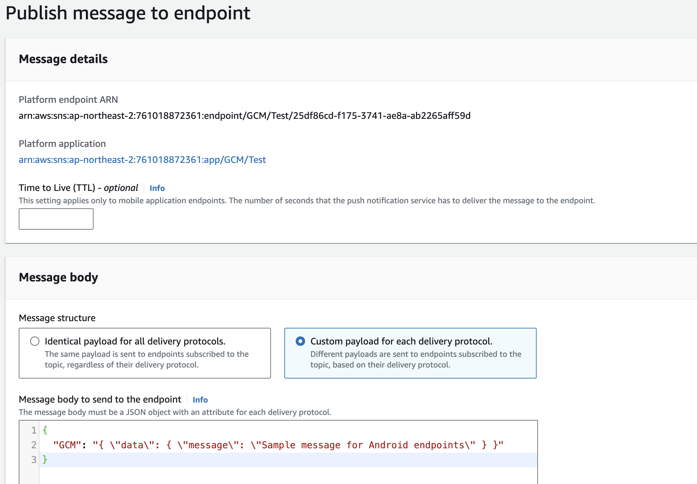

### Overview>
지난엔 대략적인 구조와 설정적인 부분을 봤다면 이번엔 해당 SDK를 호출 및 기능에 대해 구체적으로 기록하고자 한다.
뭔가 SNS를 검색하면, SQS도 연관검색어로 나오지만 이번엔 SNS -> FCM -> AOS, iOS 케이스에 대한 API 코드를 기록할 것이다.<br>
간략한 주요 개념, GUI 방식, 프로그래밍적 방식을 정리해본다.

### Contents
1. 주요 개념
   * **Topic**
        - 메시지를 게시하고 구독할 수 있는 논리적 액세스 포인트
        - 다양한 옵션으로 구독 가능
   * **Push Notification**
        - 모바일 디바이스에 메시지를 직접 전송하는 기능
2. Topic 기능
   * Topic 생성
      - 메시지를 게시할 수 있는 주제 생성
    * Topic 구독
       - 다양한 옵션으로 Topic 구독 가능
       - 구독 옵션에 따라 메시지 수신 방식 결정
       - (수행해본적없음) PlatformApplication 내 Endpoint Arn을 통해 구독 가능
    * Topic 게시(Publish)
      - 특정 Topic에 메시지 게시
      - 구독 옵션과 형태에 따라 지정된 액션 수행
3. Push Notification 기능
   * PlatformApplication 생성
     - 푸시 알림을 보낼 플랫폼 애플리케이션 생성
   * Endpoint 생성
     - PlatformApplication에 Endpoint 생성
     - Device Token 필수 (대상 식별용, 보통 FCM의 token을 사용)
     - UserData 옵션 제공 (추가 정보 입력 가능)
4. 추가 정보
   - GUI 지원: AWS 콘솔을 통한 시각적 관리 가능
   - SDK 호출: 프로그래밍 방식으로 기능 구현 가능
  
### GUI 예시


> Dashboard


> 생성한 Topic에 subscrible <br>
> 여러가지 프로토콜로 subscrible 할 수 있다.


> email은 등록된 email에서 confirm을 해야된다.


> 생성한 Platform Application에 Endpoint enroll

<br>

### SDK 사용예시
AWS에서 아래와 같은 SDK를 지원한다.([나는Java로 작성해보았다.](https://sdk.amazonaws.com/java/api/latest/software/amazon/awssdk/services/sns/package-summary.html))


* **Topic**
  * Create
```java
private CreateTopicResponse createTopicResponse(String topicName){
        return awsConfig.getSnsClient().createTopic(req->req.name(topicName));
}
```
<br>
  * delete
```java
private DeleteTopicResponse deleteTopicResponse(String topicArn){
        return awsConfig.getSnsClient().deleteTopic(req->req.topicArn(topicArn));
}
```
<br>
  * subscrible
```java
private SubscribeResponse subscribeResponse(String protocol, String topicArn, String endpoint){
//        -- protocol
//        http – delivery of JSON-encoded message via HTTP POST
//        https – delivery of JSON-encoded message via HTTPS POST
//        email – delivery of message via SMTP
//        email-json – delivery of JSON-encoded message via SMTP
//        sms – delivery of message via SMS
//        sqs – delivery of JSON-encoded message to an Amazon SQS queue
//        application – delivery of JSON-encoded message to an EndpointArn for a mobile app and device.
//        lambda – delivery of JSON-encoded message to an Amazon Lambda function.
            return awsConfig.getSnsClient().subscribe(req->
             req.protocol(protocol.toUpperCase())
                .topicArn(topicArn)
                .endpoint(endpoint));
}
```
<br>
  * unsubscrible
```java
private UnsubscribeResponse unsubscribeResponse(String unSubArn){
        return awsConfig.getSnsClient().unsubscribe(req->req.subscriptionArn(unSubArn));
}
```
<br>
  * subscrible select
```java
    private ListSubscriptionsResponse listSubscriptionsResponse(){
        return awsConfig.getSnsClient().listSubscriptions();
    }
```
<br>
  * publish
```java
    private PublishResponse topicPublishResponse(String topicArn){
        return awsConfig.getSnsClient().publish(req->req.topicArn(topicArn)
                .subject("제목")
                .message("본문"));
    }
```
<br>
* **PlatformApplication**
  * PlatformApplication create
  ```java
    private CreatePlatformApplicationResponse createPlatformApplicationResponse(String applicationName){
        Map<String,String> attribute = new HashMap<>();
//        attribue.put("PlatformCredential", "Google API KEY");
        return awsConfig.getSnsClient().createPlatformApplication(req->
             req.name(applicationName)
                .platform("GCM")
                .attributes(attribute));
    }  
  ```
  > FCM(GCM)을 등록하기 위해 .json을 attribute(map)에 추가하여 API를 전송해준다.<br>
  <br>
  
  [참고 URL - SetPlatformApplicationAttributes](https://docs.aws.amazon.com/sns/latest/api/API_SetPlatformApplicationAttributes.html)
  * PlatformApplication delete
  ```java
    private DeletePlatformApplicationResponse deletePlatformApplicationResponse(String applicationArn){
        return awsConfig.getSnsClient().deletePlatformApplication(req->req.platformApplicationArn(applicationArn));
    }
  ```
  <br>
  * Endpoint create
  ```java
    private CreatePlatformEndpointResponse createPlatformEndpointResponse(String applicationArn,
                                                                          String token,
                                                                          String customUserData){
        return awsConfig.getSnsClient().createPlatformEndpoint(req->
             req.platformApplicationArn(applicationArn)
                .token(token)
                .customUserData(customUserData));
    }
  ```
  <br>
  * Endpoint delete
  ```java
    private DeleteEndpointResponse deleteEndpointResponse(String endPointArn){
        return awsConfig.getSnsClient().deleteEndpoint(req->req.endpointArn(endPointArn));
    }
  ```
  <br>
  * Endpoint select
  ```java
    private ListEndpointsByPlatformApplicationResponse listEndpointsByPlatformApplicationResponse(String applicationArn){
        return awsConfig.getSnsClient().listEndpointsByPlatformApplication(req->req.platformApplicationArn(applicationArn));
    }
  ```
  <br>
  * Endpoint status
  ```java
    private GetEndpointAttributesResponse getEndpointStatusResponse(String endPointArn){
        return awsConfig.getSnsClient().getEndpointAttributes(req->req.endpointArn(endPointArn));
    }
  ```
  <br>
  * Endpoint publish
  ```java
    private PublishResponse notificationPublishResponse(String endPointArn, String subject, String msg){
        return awsConfig.getSnsClient().publish(req->
             req.targetArn(endPointArn)
                .messageStructure("json")
                .subject(subject)
                .message(makeMessage(subject,msg)));
    }

    private String makeMessage(String title, String bodyMessage){
        Map<String,Object> messageBodyMap = new HashMap<String, Object>();
        messageBodyMap.put("title",title);
        messageBodyMap.put("body",bodyMessage);

        Map<String,Object> messageResMap = new HashMap<String, Object>();
        messageResMap.put("notification", messageBodyMap);

        Map<String,Object> messageMap = new HashMap<String, Object>();
        messageMap.put("GCM", Utility.jsonify(messageResMap));

        log.debug("MSG ::: {}", Utility.jsonify(messageMap));

        return Utility.jsonify(messageMap);
    }
  ```


> GUI로 메시지 publish


### Message Publish
json 포맷을 맞춰서 메시지 조립하여 publish해야된다.<br>
AWS SNS → FCM → AOS Client App<br>
AWS SNS → FCM → APNS - iOS Client App<br>
FCM : “json String”으로 보내는데, notification, data,, 등이 있다.<br> 
Android Background에서 실행하기 위해서는 Notification이아닌 data로 데이터를 세팅하여 보낸다.<br>

```json
{
    aps = 
    {
        alert = 
        {
            body = "Eureka! 11";
            title = "Patient is not doing well";
        };
    };
    category = provider-body-panel;
    gcm.message_id = 0:149073;
    gcm.n.e = 1;
    google.c.a.c_id = 2825604;
    google.c.a.e = 1;
    google.c.a.ts = 149073;
    google.c.a.udt = 0;
    mutable-content = 1;
}
```
> iOS client에서 받는 데이터 형태


참고 url : [Firebase Message](https://firebase.google.com/docs/cloud-messaging/concept-options?hl=ko) , 
[APNS Message](https://developer.apple.com/library/archive/documentation/NetworkingInternet/Conceptual/RemoteNotificationsPG/PayloadKeyReference.html#//apple_ref/doc/uid/TP40008194-CH17-SW5)


### 마치면서
AWS SNS를 쓰면서 Push Notification 기능을 구현하였고, SpringBatch를 이용해서 publish를 하도록 구현하였다. 애먹엇던부분이 publish였는데 message payload를 각 native os별로 맞추는게 어려웠던거 같다.
특히 arn이 중요하다고 본다.